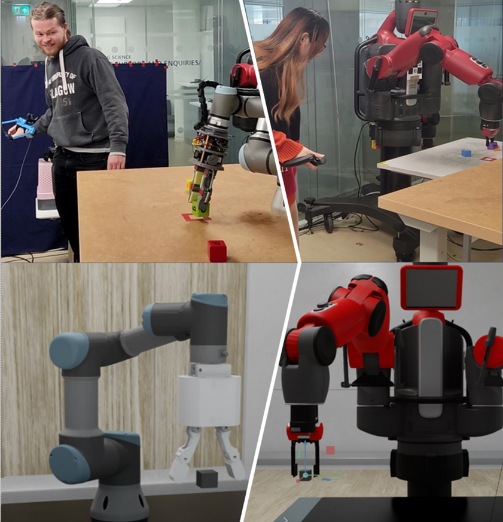

# Telesim for Isaac Sim

Package for TeleSim, a modular and plug and play teleoperation system, that can be used with any kind of robotic arms.

## Using This Package

### Instalation

Make sure you have cloned the relevant repositories from the [master repo](https://github.com/09ubberboy90/telesim_pnp) or only the relevant part for [Baxter](https://github.com/09ubberboy90/telesim_pnp_baxter.git) or [UR3](https://github.com/09ubberboy90/telesim_pnp_ur.git).

Beware if you do not download the master repo, you will only be able to use the relevant robots from this repo.

Build the workspace which will be referred henceforth as `ros_ws` using `colcon build`

Additionally install [Isaac Sim 2022.2.0](https://docs.omniverse.nvidia.com/isaacsim/latest/install_workstation.html), newer version may work but have not been tested.

### Usage

BEWARE: Do not source ROS or have ROS sourced for the following !

Find your isaac sim python path; It should be in `~/.local/share/ov/pkg/isaac_sim-2022.2.0/python.sh`. It will be referred henceforth as `isp`

Then you need to export the path of the packages you are going to use so that Isaac Sim can load them.

`export ROS_PACKAGE_PATH=ROS_PACKAGE_PATH:/opt/ros/galactic/share`

Note: This will only load the packages installed through APT not the local packages. You need to add them manually (See below for example)

#### First Time Usage

Make sure you also have installed pyquaternion for Isaac Sim. This can be done by running:

`isp -m pip install pyquaternion`

Make sure you have updated the urdf and rmp path according to your need in either [ur_t42_world.py](ur3/ur_t42_world.py) or [baxter_world.py](baxter/baxter_world.py) file. They are defined in the init as `self.urdf` and `self.rmp` respectively

#### Baxter

To add the packages needed for Baxter:

`export ROS_PACKAGE_PATH=ROS_PACKAGE_PATH:{ros_ws}/install/rethink_ee_description/share:{ros_ws}/install/baxter_description/share`

To run for baxter

`isp baxter/baxter_world.py`

#### UR

To add the packages needed for UR3 with the T42 gripper:

`export ROS_PACKAGE_PATH=ROS_PACKAGE_PATH:{ros_ws}/install/t42_gripper_description/share`

To run for the UR3

`isp ur/ur_t42_world.py`

## Adding new Robots

Create a new folder with the robot name

Create a copy of one of the {robot}_world.py and of the {robot}_robot.py file.

Makes changes in the {robot}_robot.py, such as the gripper joint name (for more than 2 gripper joint use grippers.py as base) in the Cortex class. Make sure to update the files about the robot configuration.

## Using different controller

To add a new type of controller, Make sure to update if need the listening path in your {robot}_world.py.

Additionally in the function `move_right_cube_callback` make sure to update the quaternion multiplication so that it will match the resting pose of the controller.

Note: If you are using HTC vive Tracker the Index of the tracker may change with each restart. This is due to a change of SteamVR and has not been corrected yet
